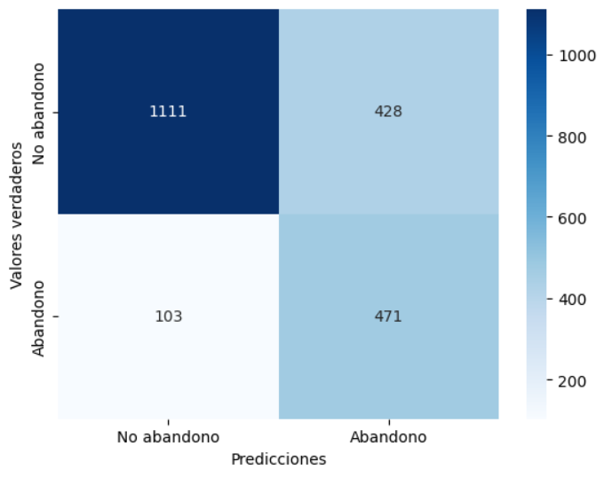

# CUSTOMER CHURN PREDICTION WITH MACHINE LEARNING

## Introduction <br>
Machine Learning project to predict customer churn for a telecommunications company.
We begin with a dataset that includes data on the different services customers have signed up for: movie streaming service, mobile lines, online backup, monthly fees, etc.
Data cleaning is performed, as well as an analysis of the variables, selecting those that best optimize our model.
Different models are tested: XGBoost, AdaBoost, RandomForest ... the best hyperparameters are calculated, and finally, Logistic Regression model is chosen as it provides the best results.

## Steps <br>
1. Dataset overview
2. Missing values
3. Univariate analysis
4. Bivariate analysis
5. Encodings
6. Correlation between features
7. Model development
8. Feature importances
9. Test score

## Metrics obtained<br>
* Recall: 0.82
* Precision: 0.52
* Accuracy: 0.74




## Libraries used:<br>
```Python``` / ```Numpy``` / ```Pandas``` / ```Matplotlib``` / ```Scikit-Learn``` / ```imblearn```

## Files and folders <br>
1. Data: contains all the data files used in the analysis.
2. Modelo: contains a pickle file with the model.
3. Notebooks: notebooks for data cleaning, processing, analysis, visualization, and machine learning model testing.
4. Project_resume : main notebook (report) of the project.
5. Enlace presentación: link to the Prezi presentation exposing results.

